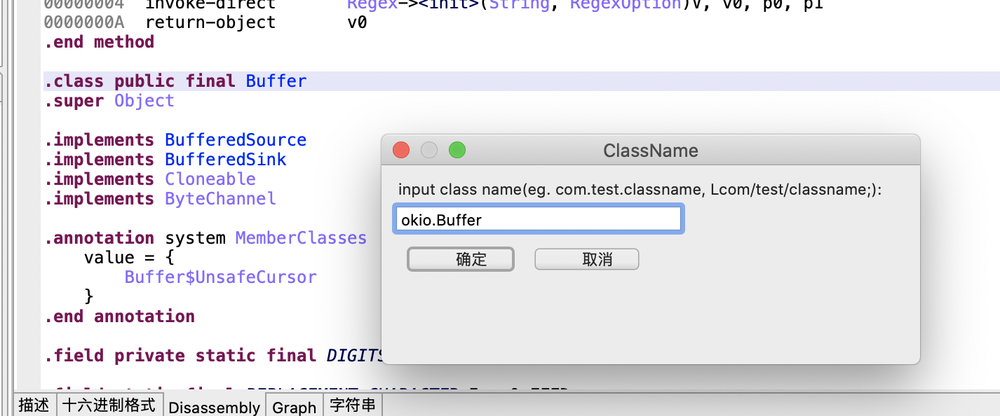
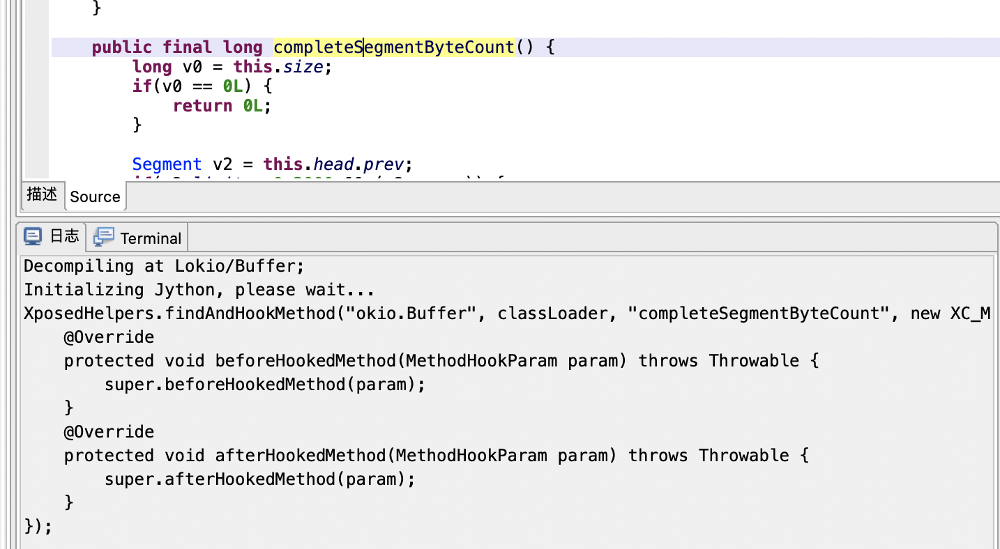

## GotoClass

背景：JEB2自带的'J'和JEB3自带的'G'不大好用，有两个不好用的地方

    1. 一定要在对应的那个 `Disassembly` 里按下快捷键，尤其是multi-dex可能需要挨个翻
    2. 一定要输入 `Lxxx/xxx/xxx;` 格式的类名
    
用途：Shift+G

    1. 输入两种格式的雷鸣，都可以跳到对应 `Disassembly` 界面的位置，一键运行。
    2. 在任意界面尝试调用 script，默认输入是当前 focus 的内容。有时可以省去输入，例如从 Manifest 跳转到实现时。

## FastXposed

背景：Xposed手抄一遍太麻烦。

用途：Shift+X。光标锁定到要Xposed的函数上，执行脚本，从输出框复制文本即可。

## 其他人写的有用的工具

[https://raw.githubusercontent.com/S3cuRiTy-Er1C/JebScripts](https://raw.githubusercontent.com/S3cuRiTy-Er1C/JebScripts) 通过sourceInfo恢复类名，兼容jeb2和jeb3的API
